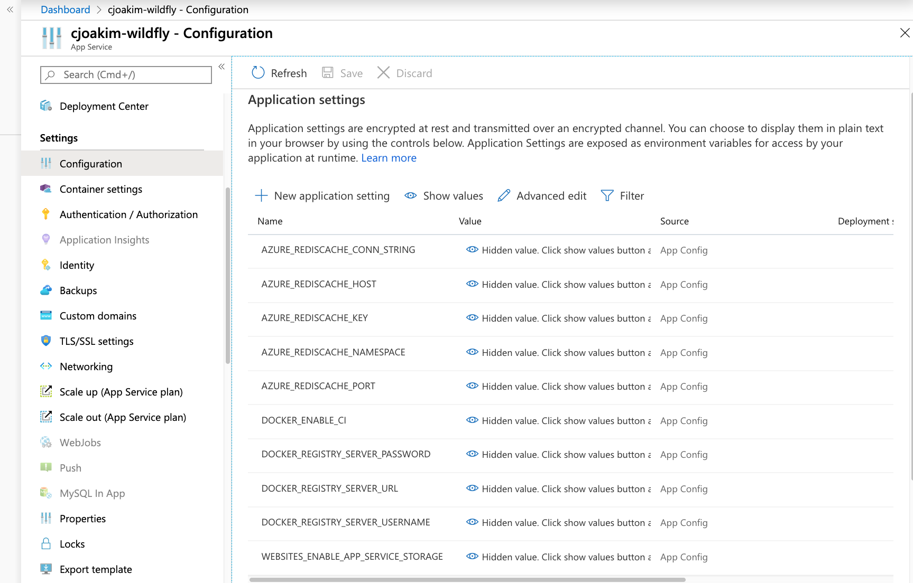
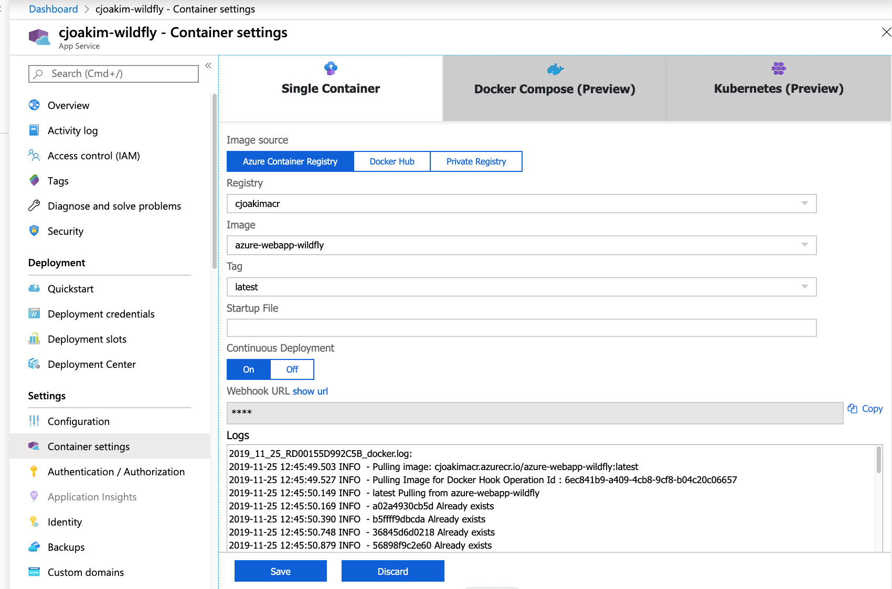

# azure-webapp-wildfly

A containerized Wildfly Java web application deployed to a Linux Azure App Service

The Web App has an index HTML page, and two simple endpoints which return JSON:
- /ping
- /redis

## Building & Testing on Developer Workstation

```
$ git clone https://github.com/cjoakim/azure-webapp-wildfly.git

$ ./build-war.sh
$ ./build-container.sh
$ ./run-container.sh
```

## Invoking the App with Curl Vs Localhost

```
$ curl "http://localhost:3000"  
$ curl "http://localhost:3000/ping" | jq 
$ curl "http://localhost:3000/redis?key=cat" | jq 
$ curl -X POST -d 'key=cat&value=elsa' 'http://localhost:3000/redis' | jq
```

## Azure Setup 

- Provision an Azure Redis Cache
- Get the Azure Redis Cache keys/config and set these local environment variables:
    - AZURE_REDISCACHE_NAMESPACE
    - AZURE_REDISCACHE_HOST
    - AZURE_REDISCACHE_KEY
    - AZURE_REDISCACHE_CONN_STRING
    - AZURE_REDISCACHE_PORT
- Execute **az login** from your command line
- Execute the **create-azure-webapp.sh** shell script to create Azure resources in your subscription.  Modify this script for your own resource names.

The above shell script creates a **Linux App Service** which uses a given 
Docker Container in Azure Container Registry.

The Docker container itself is based on **jboss/wildfly** per the Dockerfile below:
```
FROM jboss/wildfly

COPY deployments/root.war /opt/jboss/wildfly/standalone/deployments/root.war
```

---

The App Service should have the following settings/environment variables 
set by the **create-azure-webapp.sh** shell script.  The application code will
read the various **AZURE_REDISCACHE_...*** environment variables in order to
connect to Azure Redis Cache.



---

These **Container Settings** enable CI/CD by the **Azure DevOps Pipeline**;
see file [azure-pipelines.yml](azure-pipelines.yml)



## Invoking the App with Curl Vs Azure

```
$ curl "https://cjoakim-wildfly.azurewebsites.net"

$ curl "https://cjoakim-wildfly.azurewebsites.net/ping" | jq
{
  "date": "2019/11/23 20:46:29",
  "build_date": "Sat Nov 23 20:43:23 UTC 2019",
  "epoch": 1574541989818,
  "build_user": "vsts",
  "redis_host": "cjoakimredis.redis.cache.windows.net"
}

$ curl "http://cjoakim-wildfly.azurewebsites.net/redis?key=cat" | jq
{
  "date": "2019/11/23 19:30:00",
  "epoch": 1574537400033,
  "operation": "get",
  "value": "Miles",
  "key": "cat"
}

$ curl -X POST -d 'key=cat&value=Elsa' 'http://cjoakim-wildfly.azurewebsites.net/redis' | jq
{
  "date": "2019/11/23 19:32:49",
  "result": "OK",
  "epoch": 1574537569785,
  "operation": "set",
  "value": "Elsa",
  "key": "cat"
}

$ curl "http://cjoakim-wildfly.azurewebsites.net/redis?key=cat" | jq
{
  "date": "2019/11/23 19:33:17",
  "epoch": 1574537597203,
  "operation": "get",
  "value": "Elsa",
  "key": "cat"
}
```
